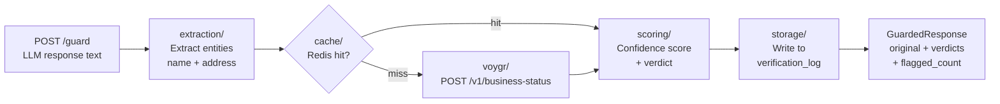

# Architecture

GuardLayer wraps any LLM interaction with a verification layer. The pipeline
is a single async chain: Extract → Cache → Verify → Score → Persist → Respond.

## Pipeline



**Extract** (`extraction/extractor.py`): calls Claude API with a JSON-forcing
system prompt to pull `[{name, address}]` pairs from arbitrary LLM text.
Handles implicit addresses, venue-only mentions, and multiple entities per response.

**Cache check** (`cache/redis_cache.py`): before every VOYGR API call, check
Redis. Key: `sha256(normalize(name) + "|" + normalize(address))`. On hit, skip
the API call entirely and go straight to scoring.

**Verify** (`voygr/client.py`): POST to VOYGR's `/v1/business-status` with
`{name, address}`. Returns `existence_status` and `open_closed_status`.
Exponential backoff (3 retries, jitter). Token bucket for rate limiting (default
10 RPM, configurable). Gracefully returns `uncertain` verdict when key is absent.

**Score** (`scoring/confidence.py`): maps VOYGR response to a confidence
percentage and a verdict enum (VERIFIED / FLAGGED / FATAL_FLAW / UNCERTAIN).
Sets `needs_enrichment: true` when confidence < CONFIDENCE_THRESHOLD.
Fatal flaw: `existence_status = not_exists` OR `open_closed_status = closed`.

**Persist** (`storage/postgres.py`): writes one row to `verification_log` per
entity. Non-blocking — a write failure does not fail the response.

**Respond**: returns `GuardedResponse` with original text, per-entity verdicts,
`flagged_count`, `fatal_flaw_count`, and a `summary` string.

## Module ownership

| Module | Owns | Does NOT own |
|---|---|---|
| `extraction/` | Parsing LLM text into entities | Verification logic |
| `voygr/` | HTTP calls to VOYGR API | Caching, scoring |
| `cache/` | Redis read/write | Cache invalidation policy |
| `storage/` | Postgres write/read | Business logic |
| `pipeline/` | Orchestration only | Any of the above logic |
| `scoring/` | Confidence math + verdicts | Persistence |
| `api/` | HTTP layer only | Pipeline logic |

## Verdict enum

```
VERIFIED      existence_status=exists, open_closed_status=open, confidence >= threshold
FLAGGED       exists and open but confidence < threshold → needs_enrichment: true
FATAL_FLAW    existence_status=not_exists OR open_closed_status=closed
UNCERTAIN     VOYGR API unavailable or key absent — do not surface as an error
```

## PostgreSQL schema

Table: `verification_log`

| Column | Type | Description |
|---|---|---|
| `id` | SERIAL PK | |
| `entity_name` | TEXT | Extracted place name |
| `address` | TEXT | Extracted address |
| `existence_status` | TEXT | From VOYGR API |
| `open_closed_status` | TEXT | From VOYGR API |
| `verdict` | TEXT | VERIFIED / FLAGGED / FATAL_FLAW / UNCERTAIN |
| `confidence` | FLOAT | 0.0–1.0 |
| `needs_enrichment` | BOOLEAN | confidence < threshold |
| `cache_hit` | BOOLEAN | Whether Redis cache was used |
| `source_llm` | TEXT | Optional — which LLM produced the response |
| `verified_at` | TIMESTAMPTZ | |

## Build order

1. `TASK-01` — project setup, docker-compose, Makefile, .env.example
2. `TASK-02` — all Pydantic models (no external dependencies)
3. `TASK-03` — entity extraction module
4. `TASK-04` — VOYGR API client
5. `TASK-05` — Redis caching layer
6. `TASK-06` — PostgreSQL storage
7. `TASK-07` — pipeline orchestrator (depends on 03–06)
8. `TASK-08` — confidence scoring
9. `TASK-09` — FastAPI endpoints (depends on 07–08)
10. `TASK-10` — demo script and README

Tasks 03–06 have no inter-dependencies and can be built in parallel.
